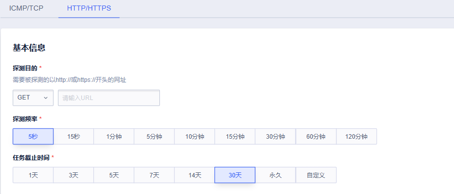
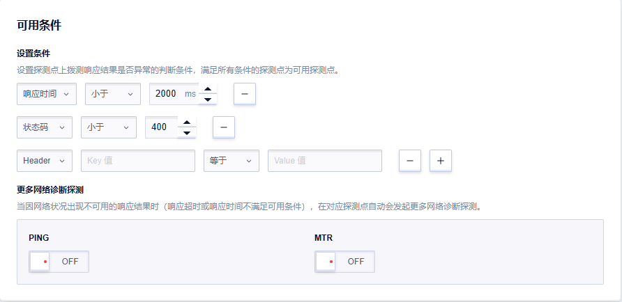
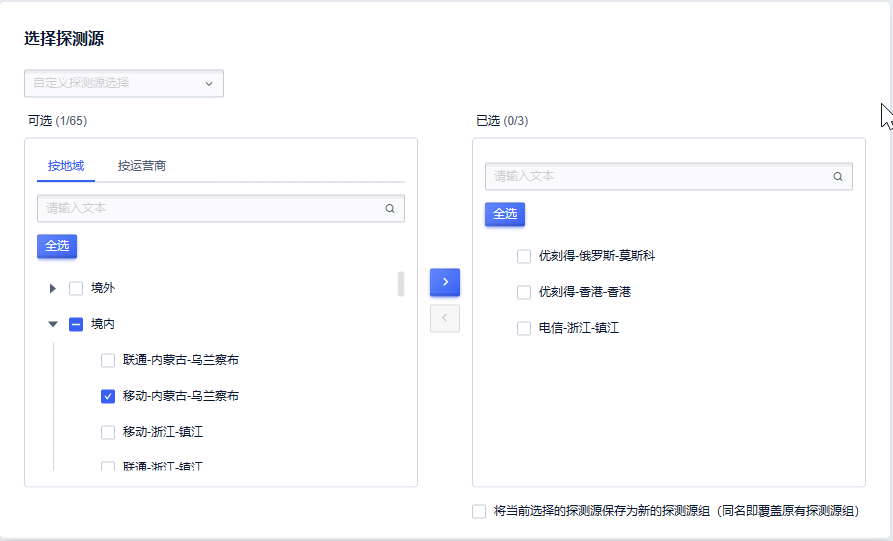
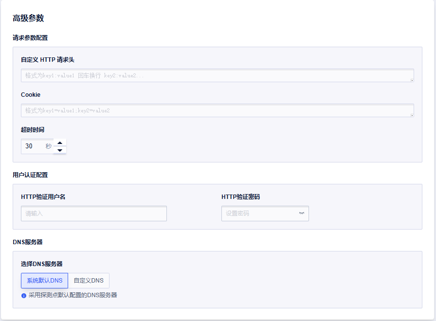
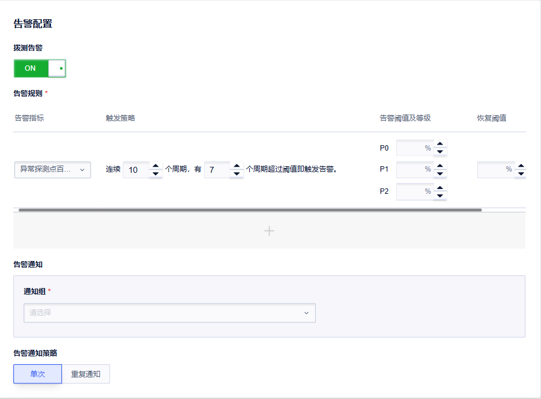

# 新建HTTP/HTTPS定时拨测任务

您可以通过创建定时拨测任务，对监测目标进行持续主动的网络探测，进而了解监测目标的网络质量情况。

**操作步骤**

1. 登录[UCloud控制台](https://passport.ucloud.cn/#login)；

2. 进入全部产品->监控与运维->网络拨测->定时拨测页面，点击[创建拨测任务](https://console.ucloud.cn/undt/)；
   

3. 在创建任务界面，选择HTTP/HTTPS标签页，填写定时拨测任务的相关信息。

   **参数填写说明**

   - 基本信息

     

     ① 选择请求方法（GET/POST）

     ② 探测目的：填写需要进行拨测的目标网址。

     ?> 例如：URL：https://www.ucloud.cn

     ③ 探测频率：支持1分钟、5分钟、10分钟、15分钟、30分钟、60分钟、120分钟的拨测频率。例如选择5分钟频率，表示每个拨测点每5分钟拨测一次。

     ④ 任务截止时间：设定结束该探测任务的时间。提供快捷时间选项，也可一自定义任务截止时间。

   - 可用条件

     

     ① 设置探测点上拨测响应结果是否异常的判断条件，满足所有条件的探测点为可用探测点。条件类型包括：

     ​	1）响应时间：判定响应时间是否符合预期，默认时间：小于2000ms。
     
     ​	2）状态码：判定响应状态码是否符合预期，默认状态码：小于400。

     ​	3）Header头：判定响应Header中的字段是否符合预期，响应Header需要您自定义。
     
     ② 提供PING、MTR探测：可自行开启，当因网络状况出现不可用的响应结果时(响应超时或响应时间不满足可用条件),在对应探测点自动会发起更多网络诊断探测。
   
   - 拨测配置

     
   
     ① 选择探测源：按照需要选择不同地域或不同运营商的探测源，也可将当前选择的探测点保存为探测源组，后续创建任务可直接选用。
   
   - 高级参数
   
     
   
     ① 请求参数配置：
   
     ​	1）自定义HTTP请求头：格式为key1:value1回车换行key2:value2
   
     ​	2）Cookie：格式为key1=value1；key2=value2
   
     ​	3）请求内容：当请求方法选择POST时，需要设置该参数。请求内容的格式为key1=value1；key2=value2 或一段 JSONobject
   
     ​	4）超过时间：默认30s，可修改
   
     ② 用户认证配置：通过HTTP协议的基础验证

     ​	1）HTTP验证用户名
   
     ​	2）HTTP验证密码
   
     ③DNS服务器：DNS服务器的IP地址，支持系统默认DNS或自定义DNS
   
   - 告警配置
   
     
   
     ① 告警规则：
   
     ​	1）监控指标：提供 异常探测点百分比 告警指标。

     ​	2）告警触发策略：设定触发告警的条件。

     ​	3）告警阈值以及等级：设定不同告警等级对应的告警阈值和恢复阈值。

     ② 告警通知：下拉选择当前项目下的通知组，支持选择多个通知组。当产生告警时，会按照平台通知组配置的通知人以及通知方式发送告警。

     ③ 告警通知策略：

     ​	1）单次：仅首次触发告警时发送告警通知。

     ​	2）重复通知：告警触发时刻至该告警恢复期间，会按照设定的通知间隔重复发送告警通知。

   - 管理设置：设置任务名称。
   
     
