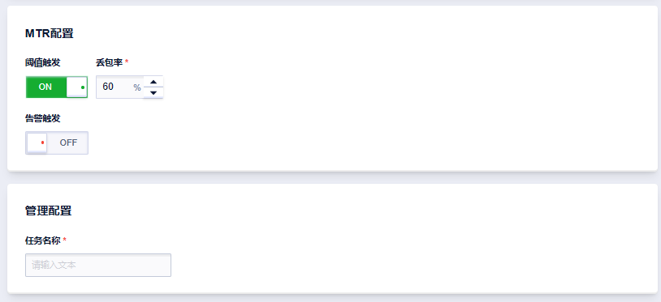

# 新建Ping定时拨测任务

您可以通过创建定时拨测任务，对监测目标进行持续主动的网络探测，进而了解监测目标的网络质量情况。

**操作步骤**

1. 登录[UCloud控制台](https://passport.ucloud.cn/#login)；

2. 进入全部产品->监控与运维->网络拨测->定时拨测页面，点击[创建拨测任务](https://console.ucloud.cn/undt/)；
   

3. 在创建任务界面，选择ICMP/TCP标签页，填写定时拨测任务的相关信息；

   **参数填写说明**

   - 基本信息

     

     ① 探测模式

     ​	单探测目的：单任务监测单个探测目的

     ​	多探测目的：支持单任务同时监测多个探测目的

     ② 探测目的：填写需要进行拨测的目标地址。

     ?> 例如：域名：www.ucloud.cn / IP：1.1.1.1

     ③ 视图层级：系统会按照探测源的运营商、国家、省市三个维度汇聚监测结果，在查看任务监测结果时，可按照选定的视图层级逐层下钻，查看不同维度的网络质量情况。

     ④ 探测频率：支持5秒、15秒、1分钟、5分钟、10分钟、15分钟、30分钟、1小时、两小时的拨测频率。例如选择5分钟频率，表示每个拨测点每5分钟拨测一次。

     ⑤ 任务截止时间：设定结束该探测任务的时间。提供快捷时间选项，也可以自定义任务截止时间。

   - 拨测配置

     

     ① 选择探测源：需要选择不同地域或不同运营商的探测源，也可将当前选择的探测点保存为探测源组，后续创建任务可直接选用。

     

     ② 拨测参数配置

     | 参数名称     | 说明                                                         | 默认值 |
     | ------------ | ------------------------------------------------------------ | ------ |
     | 协议类型     | 支持 ICMP、TCP 两种协议类型                                  | ICMP   |
     | TCP ping端口 | 协议类型选择TCP时，需要指定端口号                            | 无     |
     | 监测超时     | 定义监测超时时限，可填值范围为：2 - 20秒                     | 5      |
     | Ping包数     | 填写单次探测发送的数据包数量。可填值范围为：1-100            | 5      |
     | Ping包长     | Ping 探测时 ICMP 报文的大小，可用于分析不同报文大小在网络传输上的差异。（注意：该参数仅在 Ping 协议为 ICMP 时可用。） | 64     |
     | DSCP         | 位于每个数据包IP报文头部的服务类别TOS标识字节中，利用已使用的6比特和未使用的2比特，通过编码值来区分优先级，用于划分服务类别，区分服务的优先级。（注意：该参数仅在 Ping 协议为 ICMP 时可用。） | 0      |
     | 是否允许切片 | IP报文头部中的 DF 标志位，DF 位为 0 的时候表示路由器可以对上层数据包进行切分（默认为允许切分），DF 位为 1 是表示路由器不可进行切分。如果一个IP报文无法在不切分的情况下进行转发（例如触达 MTU 限制），则路由器会将其丢弃。（注意：该参数仅在 Ping 协议为 ICMP 时可用。） | 是     |

     ?> 注：Ping探测间隔（即每次发送数据包的时间间隔）=探测频率/Ping包数。

   - 告警配置

     

     ① 告警规则：可以为不同维度的监控指标配置告警规则。

     ​	1）告警维度：选择告警规则对应的维度，提供运营商、国家、省市、域名\IP、单个任务五个维度可选。

     | 告警维度 | 说明                                                         |
     | -------- | ------------------------------------------------------------ |
     | 单个任务 | 即该任务选择的所有探测源探测信息至所有探测目的探测数据汇聚结果满足告警规则即触发告警 |
     | 运营商   | 系统会按照运营商维度对该任务选择的所有探测源进行分类，汇聚属于同一运营商的探测数据，若其中某个运营商的探测数据满足告警规则即触发告警 |
     | 国家     | 系统会按照国家维度对该任务选择的所有探测源进行分类，汇聚属于同一个国家的探测数据，若其中某个国家的探测数据满足告警规则即触发告警 |
     | 省市     | 系统会按照省市维度对该任务选择的所有探测源进行分类，汇聚属于同一个省市的探测数据，若其中某个省市的探测数据满足告警规则即触发告警 |
     | 域名/IP  | 对该任务配置的所有探测源和探测目的，按照一一对应的关系进行监控，若某个探测源至某个探测目的的探测数据满足告警规则即触发告警 |

     ​	2）告警触发策略：设定触发告警的条件。

     ​	3）监控指标：提供丢包率和时延。至少选择一个指标。

     ​	4）阈值类型：支持静态阈值和动态阈值两种类型。（注意：目前仅时延指标支持动态阈值）。

     ​	5）告警阈值以及等级：设定不同告警等级对应的告警阈值和恢复阈值。

     ② 告警通知：下拉选择当前项目下的通知组，支持选择多个通知组。当产生告警时，会按照平台通知组配置的通知人以及通知方式发送告警。

     ③ 告警通知策略：

     ​	1）单次：仅首次触发告警时发送告警通知。

     ​	2）重复通知：告警触发时刻至该告警恢复期间，会按照设定的通知间隔重复发送告警通知。

   - MTR配置

     ① 阈值触发：若开启阈值触发，则需要设定丢包率阈值，当探测结果丢包率满足设定的阈值则会触发MTR。

     ② 告警触发：若开启告警触发，则会在产生告警时对满足告警阈值的探测源-探测目的触发MTR。

     !> 注：执行MTR会耗费大量资源，若某任务同一时间触发大量MTR，任务调度系统将会随机选取部分MTR任务执行。

   - 管理设置：设置任务名称。

     

   