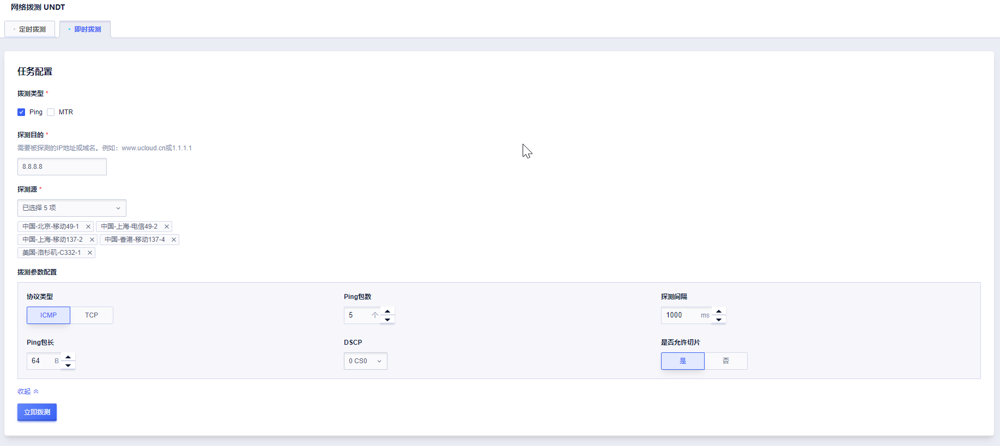

# 即时拨测

即时拨测可实现无侵入式单次拨测，并将拨测数据实时回传。当您在定时拨测任务感知到问题时，可以通过即时拨测快速验证问题。

在即时拨测页面可以选择PING 探测或者MTR探测，输入探测目的，选择探测源，也可对自定义相关参数，点击立即探测，根据您的探测配置等待1-3分钟即可查看实时探测结果。

> 注意：
> 1、即时拨测不消耗您的探测次数；
> 2、当您选择MTR时，最多只能选择5个探测源。

